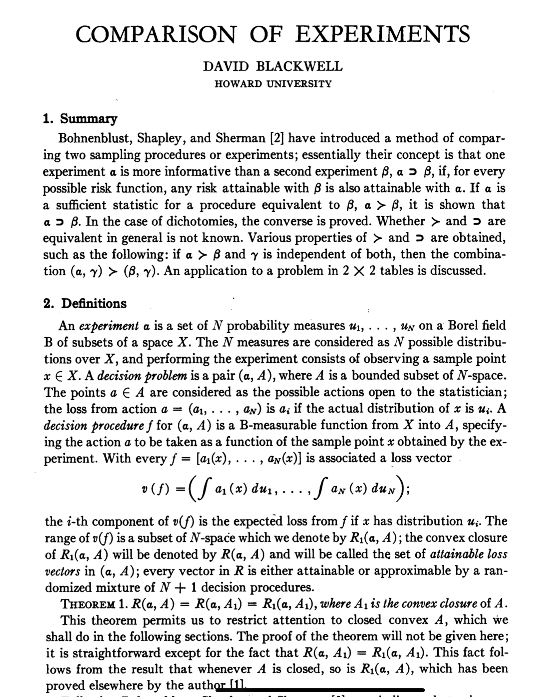
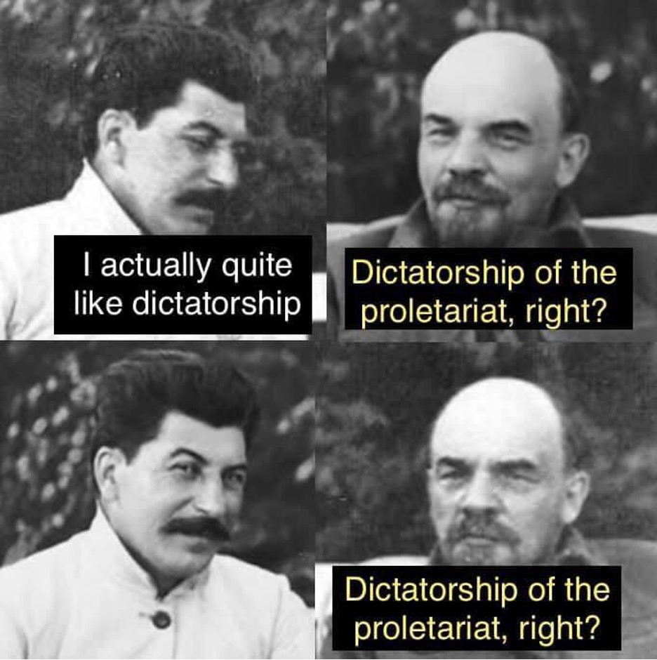
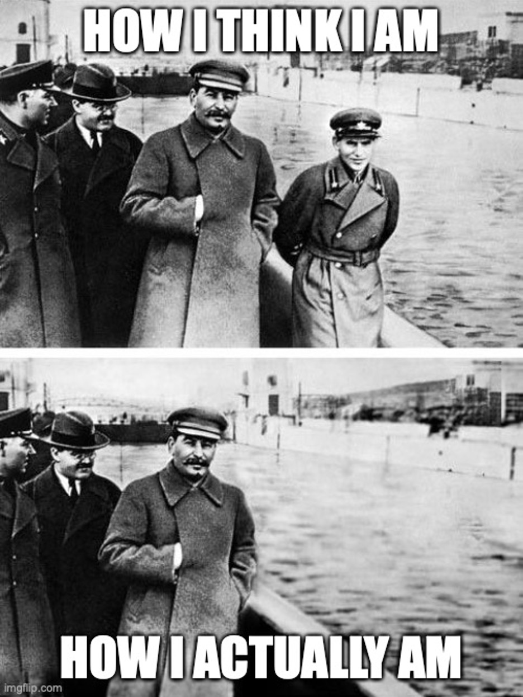
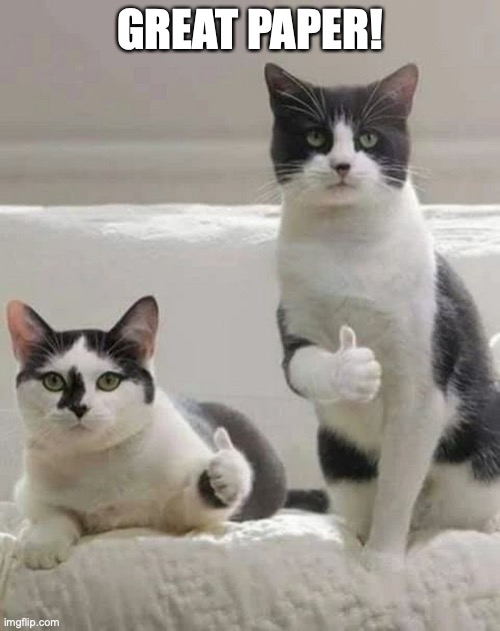

## Bibliographic Note {.b}

&nbsp;

{height=70%}

## Two Questions 

1. Is the value of evidence thesis true?
2. Is Nilanjan's decision rule good?

## Counterexamples to Value of Evidence

> - When others know what kind of knowledge you have.
> - When knowledge affects value, e.g., spoilers.
> - When knowledge comes to a group.

## A Group Example

The group has to choose between these three options.

           p          ~p
-----   ------     --------
 A        10           0
 B         0          10
 C         4           4
 
## One Decision Rule

> - We do whatever choice maximises the minimum expected utility across the group.
> - We will do C whatever evidence comes in, but no one wants that either now or later.
> - In fact everyone would pay 1 to avoid that outcome.

## Other Decision Rules

- Let's try dictatorship.
- There might be an Arrovian argument that we'll be forced into dictatorship.
- Very hard to get a decision rule that is Paretian and Bayesian other than dictatorship. (Does hard mean impossible? Good question - if someone wants to work this out/write this up, lmk.)

## But It's a Good Dictatorship, Right

&nbsp;

{height=70%}

## Nilanjan and the Dictators

- One of the Pr on the credal committee gets to call the shots.
- This avoids incoherence, as long as the dictator is coherent.

## Functionalist Worries

- What does it mean to say other Pr are even in the committee?

## Am I Really on the Committee?

&nbsp;

{height=70%}

## Inquiry

> - The solution is to say that the dictator only stays in the job for the length of an inquiry, then there is a new lottery.
> - But some inquiries run for decades.

## Suggestion One: Politics are Everywhere

- The credal committee is a committee, and how it chooses is a political problem.
- Live with evidence being costly.
- We're used to that in committee choices already.

## Suggestion Two: Irrationality is Everywhere

- Does each committee member regard the others as rational, assuming known conditionalisation?
- They regard the others as being procedurally rational, but perhaps not substantively rational.
- Each other is rational by the other's lights, but not by mine.
- So maybe I shouldn't be surprised that I want to keep information from them.

---

&nbsp;

{height=90%}

