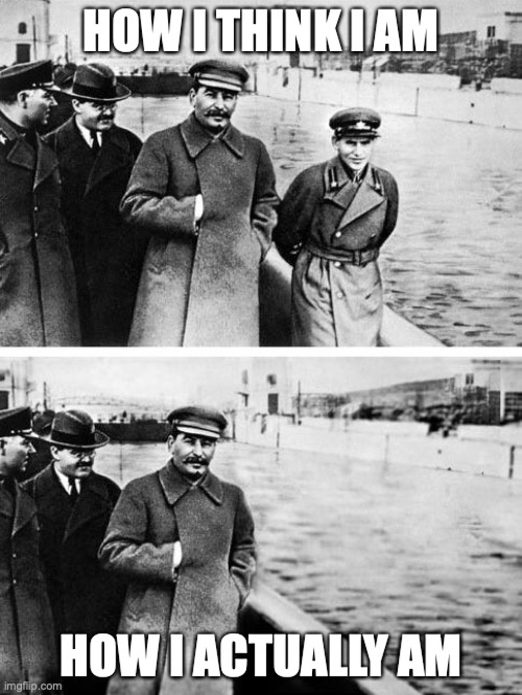

Nilanjan's paper is a great tour of some questions that are relevant to a lot of areas in philosophy. I'm going to focus here on two questions. First, should we buy the value of evidence thesis? Second, what should we make of the proposed decision rule that Nilanjan suggests?

There are a bunch of real world cases where more knowledge is bad for us. Here are three.

First, if everyone knows what kind of things you know, it is often better to know less. If you're delivering a huge amount of cash in a safe with a combination lock, it's best to not know the combination, and for this to be public knowledge. The obvious alternative is that sooner or later, you'll get robbed.

Second, if the value of an activity is related to what you know about it, very often it is good to have less knowledge. That's why we are careful about spoiler alerts, why we avoid seeing the score before watching a game on tape, and so on.

Neither of these cases are strictly speaking inconsistent with the value of evidence thesis. But they do complicate it. Stating the thesis carefully in a way that avoids them is, I think, a bit of work. You can end up saying something not much more substantial that evidence is valuable except when it isn't. 

The third case is more relevant to our story. It's easy to construct groups where every member of the group prefers that the group as a whole not receive some evidence. Let’s construct such a case that might seem very familiar if you’ve read Das’s paper. The group has to choose between options A, B and C. The payout to each option is a function of whether p is true. Here is the payout table.

           p          ~p
-----   ------     --------
 A        10           0
 B         0          10
 C         4           4

Right now, everyone in the group has probability 0.5 for p. So they think do A or B, whatever doesn't matter which, but don't do C.

There is some q such that for any value v between 0 and 1, there is someone in the group whose probability for p given q is approximately v. (It won't matter precisely what 'approximately' means here, as long as it's within 0.1.) So if the group learns whether or not q is true, they will disagree a lot.

What happens next depends on their rules for group decision making. Let's say that their rule is to choose the option that has the highest minimum expected value across the expectations of every group member. Then when the group learns whether or not q is true, they will choose C, not A or B. But that's bad, they think that C is worse than A or B. They would all rather that they all didn't know whether q was true.

How could we avoid this result? It turns out to be rather hard. If we know how many people in the group have each view about the conditional probability of q given p, we can use some formal results due to Jeff Russell, Lara Buchak and John Hawthorne to solve the problem. Roughly, we construct a group probability as something like the geometric means of the individual probabilities, and use it for decisions. But let's say we don't know that; we just know what views are represented, not how widely they are shared.

Here we are getting very close to an Arrovian agglomeration puzzle, in the sense that the only coherent solution is dictatorship. We just choose one person from the group, arbitrarily, and let them decide for the group as a whole. That person will not choose C. Great! Except for the whole dictatorship part. How bad is that? One thing we know from history is that there are bad dictatorships and worse dictatorships. Here's the point in meme form, presumably made by a Lenin fanboy.

{width=40%}

But I don't know, if it's arbitrary enough who gets to be the dictator, and we rotate who the dictator is often enough, maybe this is good socialist sortition not bad communist dictatorship. Let's leave the political issues aside for a minute or two and return to imprecise probability.

Because Nilanjan's solution is this kind of dictatorial model. One of the Pr on the committee gets to run the show for the duration of the 'inquiry'. What the person does is what that committee member, the General Secretary of the committee I guess, wants. And as long as that person is coherent, the group as a whole avoids both incoherence, and evidence avoidance.

One worry, especially if you were raised as a functionalist, is it's now a hard question what it means to say the other Pr, the ones who don't get input into the decision, are on the committee at all. I think they are part of my credal state, but if they don't do the things credences are supposed to do - guide action under uncertainty, are they really there? In meme form, the problem looks like this. 

{width=40%}
 
Look at that nervous looking Probability function worried he's standing too close to the canal, hoping to stay on the credal committee. 

Nilanjan is sensitive to this problem, and his solution is that the dictator's term of office only lasts as long as the 'inquiry' is underway. But I'm a bit worried this doesn't solve the problem. I've been inquiring off and on into how imprecise probabilities are supposed to work for 25 years, and I don't feel closer to the answer. This is feeling less like Cincinattus doing one job and going back to his farm, and more like, well, that guy with the moustache.

I don't have a solution to offer here, but I will end with two thoughts. 

First thought is that we should take the talk of credal commitees seriously, and think about this as a kind of political problem. And then maybe it doesn't seem so bad to think evidence has negative value. Most of us like rules about excluding evidence from jury trials, for example, and I think there are potential parallels to the cases where imprecise credence leads to evidence being disvalued.

Second thought is that we should fuss a bit about what it means to regard oneself as responding rationally to evidence. Think about my committee who agrees that probability p is 0.5, but will diverge once they hear whether q is true. Does each person on the committee regard the others as rational? Well, they think that the others will each conditionalise, so yay. But they think that half of them will respond to getting evidence for p by lowering their probability in p. So, fairly loud boo. The same is true of the imprecise agent. Even if they will conditionalise, each member of the credal committee thinks many of the others will do weird things on receiving evidence. Internally coherent, but weird. So maybe it shouldn't be a surprise that each of them wants to keep evidence away from the group, and value of evidence should fail.

There are a million other interesting things I could have talked about in Nilanjan's rich and rewarding paper, and I'm grateful for the chance to comment on it, and looking forward to the Q&A.
